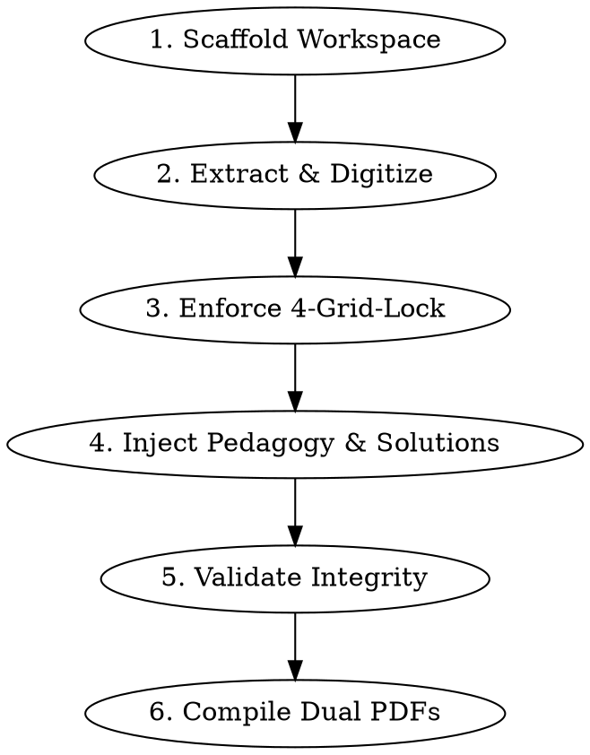

# Math Worksheet Generator

Extract math problems from scanned handouts, exam papers, or PDFs, structure them into a standardized 2×2 grid layout, and compile them into high-precision, print-ready A4 **Problem Worksheets** and **Solution Worksheets** using Headless Google Chrome and KaTeX.

## Workflow



---

## 🎯 Input Arguments & Student Name Handling (이름 인자 처리 규칙)

사용자가 `/math-worksheet-generator [인자...]` 또는 대화로 호출할 때 학생 이름 인자 전달 여부에 따라 다음과 같이 엄격히 분기합니다:

| 구분 | 이름을 인자(args)로 전달한 경우 | 이름을 인자(args)로 주지 않은 경우 (기본값) |
|---|---|---|
| **예시** | `/math-worksheet print.pdf 홍길동` | `/math-worksheet print.pdf` |
| **`meta.student`** | 전달된 이름 (예: `"홍길동"`) | **`""` (빈 문자열 또는 생략)** |
| **헤더 표기** | `홍길동 | 2026. 09. 12 | 확인 [ ]` | **`2026. 09. 12 | 확인 [ ]` (이름/구분자 미표기)** |
| **이름 임의 생성** | 명시된 이름 사용 | **어떠한 가상의 이름이나 "서영이" 등도 표기하지 않음** |
| **`meta.cheer`** | `"{학생명}의 완벽한 내신 1등급을 응원합니다 ✨"` | `"완벽한 내신 1등급을 응원합니다 ✨"` |
| **해설지 태그** | `"{학생명} 맞춤 3단계 알고리즘 점검 & 오답 노트"` | `"3단계 알고리즘 점검 & 오답 노트"` |
| **산출물 PDF** | `<학생명>_<과목>_<단원명>.pdf` | `<과목>_<단원명>.pdf` (학생명 접두사 없음) |

---

## Step 1: Scaffold Workspace & Assets

> [!NOTE]
> In this repository (`project-sy`), the core templates, vendor fonts (`template/vendor/`), test suites (`tests/`), modular PDF pipeline (`scripts/pdf/`), and the backward-compatible PDF build pipeline (`generate_pdf.py`) are already fully configured in the project root.

If resetting or verifying asset integrity, the bundled assets inside this skill can be referenced:

```bash
SKILL_DIR=".agents/skills/math-worksheet-generator"

# To inspect or re-sync templates/scripts if needed:
# cp -R "$SKILL_DIR/assets/template/"* template/
# cp "$SKILL_DIR/assets/scripts/generate_pdf.py" ./generate_pdf.py
# mkdir -p scripts/pdf && cp -R "$SKILL_DIR/assets/scripts/pdf/"* scripts/pdf/
# cp "$SKILL_DIR/assets/scripts/test_problems_data.py" tests/test_problems_data.py
```

- **Completion Criterion**: `template/worksheet.html`, `template/style.css`, `generate_pdf.py`, `scripts/pdf/` (`core.py`, `config.py`, `build_<publisher>.py`, `build_all.py`), and `tests/test_problems_data.py` are present and ready in the workspace.

---

## Step 2: Extract & Digitize Problems

Scan the source document (PDF or images) page by page:
1. Extract question statements, KaTeX math expressions, and subquestions `(1)`, `(2)`.
2. Extract teacher's handwritten notes, marginal problems, or starred problems with `tag: "필기"`.
3. If subquestions contain long polynomials, fractions, or radicals, they will automatically format in single-column vertical stack (`card__subs--stack`) to prevent formula truncation.
4. **No Naked LaTeX Rule (생 수식/명령어 누출 절대 금지)**:
   - 한국어 본문, 소문항, 힌트, 해설 및 볼드체(`**...**`) 내의 모든 LaTeX 명령어(`\mathrm{P}`, `\mathrm{A}`, `\frac`, `\sqrt`, `\pi`, `\le`, `\ge`, `\pm` 등)와 단독 변수는 **반드시** `$...$` 기호로 감싸야 합니다.
   - ❌ 절대 금지: `점 \mathrm{P}`, `t=2에서의 점 \mathrm{P}`, `**288\pi**`, `**2\sqrt{2}**`, `**-\sqrt{3} < a < \sqrt{3}**`
   - ⭕ 엄격 준수: `점 $\mathrm{P}$`, `$t=2$에서의 점 $\mathrm{P}$`, `**$288\pi$**`, `**$2\sqrt{2}$**`, `**$-\sqrt{3} < a < \sqrt{3}$**`

- **Completion Criterion**: All target problems and notes from the source are transcribed into LaTeX/KaTeX without syntax errors or naked LaTeX leaks.

---

## Step 3: Enforce 4-Grid-Lock & Twin Variations

A 2×2 A4 grid strictly holds 4 problems per page (card height locked to 120.5mm).
1. Check `len(problems) % 4`.
2. If `len(problems) % 4 != 0`, calculate missing slots $K = 4 - (\text{len} \pmod 4)$.
3. Generate $K$ twin variation problems (`쌍둥이 유제`) by altering numbers from key problems in the same chapter.
4. Mark twin problems with `source: "AI 숫자 변형 (XX번 쌍둥이)"` and `tag: "쌍둥이유제"`.

- **Completion Criterion**: `len(problems) % 4 == 0` is strictly satisfied. No empty slots on any page.

---

## Step 4: Inject 3-Step Pedagogy & Solutions

Follow the rules in `references/pedagogy_guide.md`:

1. **💡 Tip Formulation**:
   - Direct the student through the **3-Step Algorithm**:
     - `1단계: 선 대입` — $x=a$를 먼저 대입하기!
     - `2단계: 식 변형` — $\frac{0}{0}$ 인수분해·유리화, $\frac{\infty}{\infty}$ 최고차항 나누기.
     - `3단계: 재대입` — 변형된 식에 다시 대입하여 정답 도출.
   - **절댓값 함수**: *"절댓값 함수의 경우, 반드시 구간별로 나누어 주어진 함수로 변경해서 풀기"* 원칙 강제.

2. **📝 Solution Steps Formulation**:
   - Provide structured steps in `solution.steps`:
     ```javascript
     "solution": {
       "steps": [
         { "label": "[1단계: 선 대입]", "content": "$x=1$ 대입 시 $\\frac{0}{0}$ 꼴(부정형)" },
         { "label": "[2단계: 식 변형]", "content": "분자 인수분해: $\\frac{(x-1)(x+2)}{x-1} = x+2$" },
         { "label": "[3단계: 재대입]", "content": "$x=1$ 대입 시 $1+2 = 3$ $\\therefore$ **3**" }
       ]
     }
     ```
   - For subquestions, use `label: "(1)"` and `label: "(2)"`.

- **Completion Criterion**: Every problem object contains non-empty `tip`, `answer`, and valid `solution.steps`.

---

## Step 5: Validate Data Integrity

Run the automated linter to verify schema, 4-grid-lock, and KaTeX balance:

```bash
python3 tests/test_problems_data.py data/problems_part1.js
python3 -m unittest tests/test_problems_data.py
```

- **Checks performed**:
  - `len(problems) % 4 == 0`
  - Even count of KaTeX `$` delimiters in all strings (`count % 2 == 0`)
  - **Zero Naked LaTeX**: 수식 구분자(`$`) 밖으로 누출된 LaTeX 명령어(`\mathrm`, `\frac`, `\sqrt`, `\pi` 등) 전수 검증 (누출 발견 시 즉시 예외 발생)
  - 3-Step Pedagogy tips contain required mathematical keywords
  - No empty labels or contents
  - Required metadata (`title`, `subtitle`, `date`), and optional `student` (인자 미제공 시 빈 문자열 허용)
- **Completion Criterion**: Test suite passes with exit code 0 (`PASS: ... is valid`).

---

## Step 6: Compile Dual PDFs & Visual Verification

Execute the modular Headless Chrome PDF builders:

```bash
# Specific publisher:
python3 scripts/pdf/build_<name>.py

# Specific part:
python3 scripts/pdf/build_<name>.py 1

# All textbooks:
python3 scripts/pdf/build_all.py  # (or python3 generate_pdf.py all)
```

> [!IMPORTANT]
> **신규 교재/학습지 추가 시 독립 러너 생성 필수 규칙**:
> **"신규 교재/학습지 추가 시 `scripts/pdf/build_<새교재>.py` 독립 실행 스크립트를 별도 파일로 반드시 생성하고 `scripts/pdf/config.py`에 등록"**
>
> **신규 러너 표준 템플릿 (`scripts/pdf/build_<name>.py`)**:
> ```python
> #!/usr/bin/env python3
> import sys
> from pathlib import Path
> 
> PROJECT_ROOT = Path(__file__).resolve().parent.parent.parent
> sys.path.insert(0, str(PROJECT_ROOT))
> 
> from scripts.pdf.core import run_group_builder
> from scripts.pdf.config import <PUBLISHER>_PARTS
> 
> if __name__ == "__main__":
>     run_group_builder("<출판사명>", <PUBLISHER>_PARTS, PROJECT_ROOT)
> ```

- **Deliverables (`output/`)**:
  - **이름 인자 제공 시**: `<학생명>_<과목>_<단원명>.pdf` / `<학생명>_<과목>_<단원명>_해설지.pdf`
  - **이름 인자 미제공 시**: `<과목>_<단원명>.pdf` / `<과목>_<단원명>_해설지.pdf` (학생명 접두사 제외)
  - 문제지 — 5mm 도트 모눈 풀이 공간 제공
  - 해설지 — 단계별 풀이 조판 + 강조 정답란 + 빠른 정답표 부록

### Visual Quality Inspection
Render pages with `pdftoppm` to inspect key cards:
```bash
pdftoppm -png -r 150 output/<파일명>.pdf scratch/inspect/page
```
- Verify zero truncation on right side of formulas.
- Verify zero card overflow (card strictly fits within 120.5mm without spilling to extra pages).

- **Completion Criterion**: Both Problem and Solution PDFs exist in `output/` and have been verified visually.
