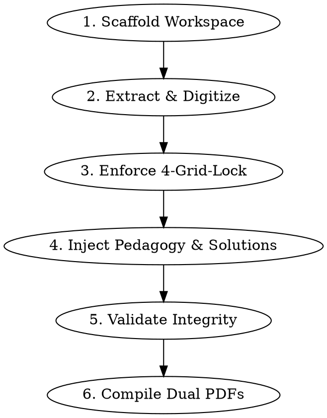

# Math Worksheet Generator

Extract math problems from scanned handouts, exam papers, or PDFs, structure them into a standardized 2×2 grid layout, and compile them into high-precision, print-ready A4 **Problem Worksheets** and **Solution Worksheets** using Headless Google Chrome and KaTeX.

## Workflow



---

## Step 1: Scaffold Workspace & Assets

> [!NOTE]
> In this repository (`project-sy`), the core templates, vendor fonts (`template/vendor/`), test suites (`tests/`), and the PDF build pipeline (`generate_pdf.py`) are already fully configured in the project root.

If resetting or verifying asset integrity, the bundled assets inside this skill can be referenced:

```bash
SKILL_DIR=".agents/skills/math-worksheet-generator"

# To inspect or re-sync templates/scripts if needed:
# cp -R "$SKILL_DIR/assets/template/"* template/
# cp "$SKILL_DIR/assets/scripts/generate_pdf.py" ./generate_pdf.py
# cp "$SKILL_DIR/assets/scripts/test_problems_data.py" tests/test_problems_data.py
```

- **Completion Criterion**: `template/worksheet.html`, `template/style.css`, `generate_pdf.py`, and `tests/test_problems_data.py` are present and ready in the workspace.

---

## Step 2: Extract & Digitize Problems

Scan the source document (PDF or images) page by page:
1. Extract question statements, KaTeX math expressions, and subquestions `(1)`, `(2)`.
2. Extract teacher's handwritten notes, marginal problems, or starred problems with `tag: "필기"`.
3. If subquestions contain long polynomials, fractions, or radicals, they will automatically format in single-column vertical stack (`card__subs--stack`) to prevent formula truncation.

- **Completion Criterion**: All target problems and notes from the source are transcribed into LaTeX/KaTeX without syntax errors.

---

## Step 3: Enforce 4-Grid-Lock & Twin Variations

A 2×2 A4 grid strictly holds 4 problems per page (card height locked to 120.5mm).
1. Check `len(problems) % 4`.
2. If `len(problems) % 4 != 0`, calculate missing slots $K = 4 - (\text{len} \pmod 4)$.
3. Generate $K$ twin variation problems (`쌍둥이 유제`) by altering numbers from key problems in the same chapter.
4. Mark twin problems with `source: "AI 숫자 변형 (XX번 쌍둥이)"` and `tag: "쌍둥이유제"`.

- **Completion Criterion**: `len(problems) % 4 == 0` is strictly satisfied. No empty slots on any page.

---

## Step 4: Inject 3-Step Pedagogy & Solutions

Follow the rules in `references/pedagogy_guide.md`:

1. **💡 Tip Formulation**:
   - Direct the student through the **3-Step Algorithm**:
     - `1단계: 선 대입` — $x=a$를 먼저 대입하기!
     - `2단계: 식 변형` — $\frac{0}{0}$ 인수분해·유리화, $\frac{\infty}{\infty}$ 최고차항 나누기.
     - `3단계: 재대입` — 변형된 식에 다시 대입하여 정답 도출.
   - **절댓값 함수**: *"절댓값 함수의 경우, 반드시 구간별로 나누어 주어진 함수로 변경해서 풀기"* 원칙 강제.

2. **📝 Solution Steps Formulation**:
   - Provide structured steps in `solution.steps`:
     ```javascript
     "solution": {
       "steps": [
         { "label": "[1단계: 선 대입]", "content": "$x=1$ 대입 시 $\\frac{0}{0}$ 꼴(부정형)" },
         { "label": "[2단계: 식 변형]", "content": "분자 인수분해: $\\frac{(x-1)(x+2)}{x-1} = x+2$" },
         { "label": "[3단계: 재대입]", "content": "$x=1$ 대입 시 $1+2 = 3$ $\\therefore$ **3**" }
       ]
     }
     ```
   - For subquestions, use `label: "(1)"` and `label: "(2)"`.

- **Completion Criterion**: Every problem object contains non-empty `tip`, `answer`, and valid `solution.steps`.

---

## Step 5: Validate Data Integrity

Run the automated linter to verify schema, 4-grid-lock, and KaTeX balance:

```bash
python3 tests/test_problems_data.py data/problems_part1.js
python3 -m unittest tests/test_problems_data.py
```

- **Checks performed**:
  - `len(problems) % 4 == 0`
  - Even count of KaTeX `$` delimiters in all strings (`count % 2 == 0`)
  - No empty labels or contents
  - Mandatory metadata (`title`, `subtitle`, `student`, `date`)
- **Completion Criterion**: Test suite passes with exit code 0 (`PASS: ... is valid`).

---

## Step 6: Compile Dual PDFs & Visual Verification

Execute the one-click Headless Chrome builder:

```bash
# Build Problem Worksheets and Solution Worksheets
python3 generate_pdf.py all
```

- **Deliverables (`output/`)**:
  - `<학생명>_<과목>_<단원명>.pdf` (문제지 — 5mm 도트 모눈 풀이 공간 제공)
  - `<학생명>_<과목>_<단원명>_해설지.pdf` (해설지 — 단계별 풀이 조판 + 강조 정답란 + 빠른 정답표 부록)

### Visual Quality Inspection
Render pages with `pdftoppm` to inspect key cards:
```bash
pdftoppm -png -r 150 output/<파일명>.pdf scratch/inspect/page
```
- Verify zero truncation on right side of formulas.
- Verify zero card overflow (card strictly fits within 120.5mm without spilling to extra pages).

- **Completion Criterion**: Both Problem and Solution PDFs exist in `output/` and have been verified visually.
